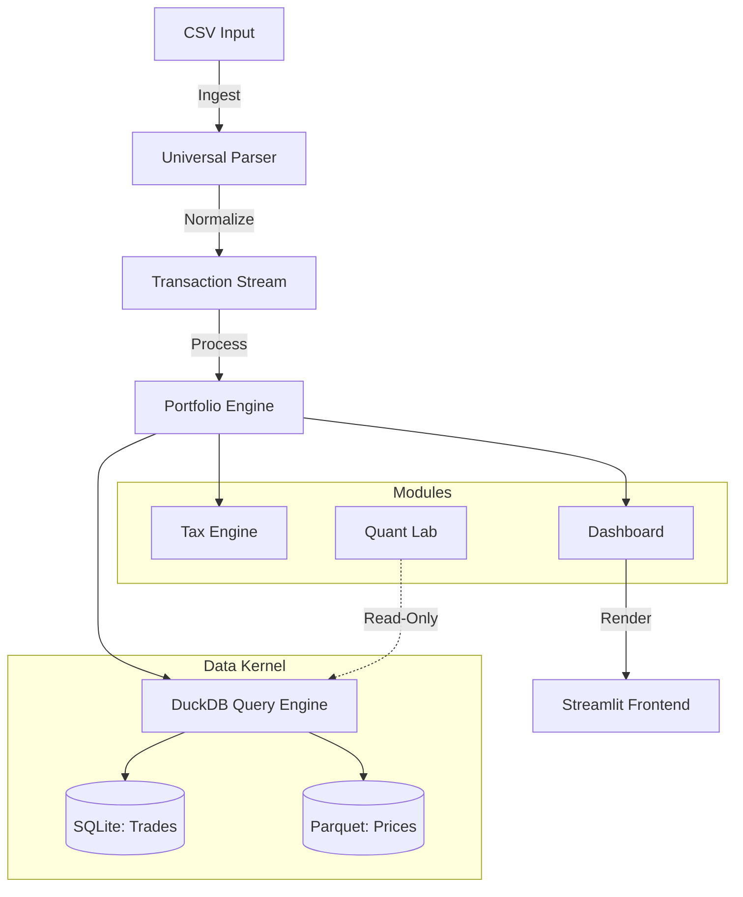

# Portfolio Viewer

**A self-hosted Portfolio Dashboard built with Python.**

---

### **Overview**
Portfolio Viewer is a local portfolio tracking application designed for users who want full control over their data and calculations. Unlike commercial aggregators or web-based services, this application runs entirely on your local machine or private server, reconstructing portfolio state directly from transaction logs.

**Main Features:**
*   **Extensible Logic**: Users can modify the `calculators/` directory to implement custom risk models or specific tax logic using standard Python, without needing to learn complex frontend frameworks.
*   **Self-Hosted & Private**: Designed to run on personal hardware (NAS, VPS, or Desktop). Data remains locally stored.
*   **Deployment Options**: Can be run locally for privacy, or deployed as a private web app (Docker supported) to share with others.

---

### **For Engineering Leaders & Recruiters**

This project demonstrates a production-grade implementation of a financial data pipeline, featuring:

#### **Technical Stack**
*   **Core**: Python 3.9+
*   **Frontend**: Streamlit (Reactive UI), Plotly (Interactive Visualizations)
*   **Data Processing**: Pandas (Vectorized operations), NumPy/SciPy (Financial Math models)
*   **Persistence**: SQLite (Local caching of market data), Parquet (High-performance storage)
*   **APIs**: yfinance, AlphaVantage, Finnhub (with automated failover strategies)

#### **Key Architectural Decisions**
1.  **O(N) State Reconstruction**: Implements a linear-time algorithm to rebuild portfolio history from an event stream (Buys, Sells, Splits, Dividends). This avoids the standard $O(N^2)$ complexity of re-calculating positions for every historical date.
2.  **Hybrid Caching Strategy**: Utilizes a multi-layered cache (in-memory L1 + SQLite L2) to handle market data. This significantly reduces API latency and mitigates rate-limiting issues from external providers.
3.  **Robust Fallback Mechanisms**: The **`MarketDataService`** employs a chain-of-responsibility pattern to fetch prices. If the primary provider (yfinance) fails, it automatically degrades to AlphaVantage or Finnhub without user interruption.
4.  **Corporate Action Engine**: A dedicated engine standardizes and handles complex corporate events (Stock Splits, Reverse Splits, Spinoffs) to ensure historical prices and share counts remain mathematically consistent over decades of data.

---

### **For Users**

#### **What does it do?**
Portfolio Viewer transforms your scattered broker export files into a unified, beautiful dashboard. It allows you to track your Net Worth, analyze asset allocation, and monitor performance against benchmarks without sharing your sensitive financial data with third-party cloud services.

#### **Key Features**
*   **🔒 Privacy First**: Your financial data never leaves your computer. No cloud uploads, no tracking.
*   **⚡ Professional Analytics**:
    *   **True Performance**: Uses **XIRR** (Extended Internal Rate of Return) for money-weighted return calculations, the gold standard for active portfolios.
    *   **Risk Metrics**: Automatically calculates Volatility, Sharpe Ratio, and Maximum Drawdown.
*   **Modern UI**: Features a responsive design with dark mode and mobile support.
*   **🤝 Secure Collaboration**: The application is container-ready. You can easily deploy a private instance to the cloud, giving friends, family, or clients their own "personal app" to view their portfolio, protected by **PBKDF2 SHA-256** authentication.
*   **🌍 Multi-Currency**: Native support for assets in USD, EUR, GBP, CHF, and more, with automatic historical currency conversion.

---

### **Deployment (Docker)**

Turn this script into a persistent application on your NAS or VPS in seconds.

1.  **Build the Image**
    ```bash
    docker build -t my-portfolio .
    ```

2.  **Run the Container**
    ```bash
    docker run -d -p 8501:8501 --name portfolio_app my-portfolio
    ```
    Access your dashboard at `http://localhost:8501`.

### **Installation (Local)**

#### **Prerequisites**
*   Python 3.9+
*   Git

#### **Setup**
1.  **Clone & Install**
    ```bash
    git clone https://github.com/your-repo/portfolio-viewer.git
    cd portfolio-viewer
    pip install -r requirements.txt
    ```

2.  **Run**
    ```bash
    streamlit run portfolio_viewer.py
    ```

#### **Configuration (Optional)**
To enable robust price fetching fallback, create a `.streamlit/secrets.toml` file:

```toml
[passwords]
app_password_hash = "pbkdf2_sha256$..." # Generated via utils/auth.py

[api]
alpha_vantage_key = "YOUR_KEY_HERE"
finnhub_key = "YOUR_KEY_HERE"
```

---

### **System Architecture**

**Modular Monolith - "Library-First" Design**

The application runs as a single Docker container but maintains strict internal separation between layers. This architecture provides the simplicity of a monolith with the maintainability of modular code.

#### **Architecture Layers**

```
/portfolio-platform
├── data/                   # [GIT IGNORED] Persistence Layer
│   ├── portfolio.db        # SQLite: Trades, Settings, Audit Logs
│   └── market_cache/       # Parquet: OHLCV Data (One file per ticker)
│
├── core/                   # The "Kernel"
│   ├── db.py               # DuckDB + SQLite connection manager
│   ├── market.py           # Data fetcher -> Parquet
│   └── hashing.py          # SHA256 audit logic
│
├── modules/
│   ├── tax/                # The Compliance Engine ("The Fortress")
│   ├── viewer/             # Dashboard Logic
│   └── quant/              # Research Sandbox (Read-Only)
│
├── ui/                     # Streamlit Frontend
├── tests/                  # Hypothesis & Invariant Tests
├── Dockerfile
└── docker-compose.yml
```

#### **The Data Kernel**

**Hybrid Storage Strategy:**
- **Trades (SQLite)**: Transactional data stored in `data/portfolio.db` with strict types and foreign keys
- **Prices (Parquet)**: Time-series market data stored in `data/market_cache/` for efficient columnar storage
- **The Glue (DuckDB)**: Python wrapper that can query both SQLite and Parquet files seamlessly

**Core Components:**
- `core/db.py`: Unified database connection manager
- `core/market.py`: Market data fetcher with Parquet storage
- `core/hashing.py`: SHA256 hasher for audit trails and calculation verification

#### **The Tax Engine ("The Fortress")**

Immutable, verifiable tax calculation system:
- **Event Loop**: Replays transaction history chronologically
- **Audit Trail**: Append-only log in `tax_audit_log` table
- **Sealed Calculations**: Each tax calculation is SHA256-sealed with inputs/outputs

Example audit entry:
```json
{
  "event_id": "TAX_2024_uuid",
  "timestamp": "2024-03-15T10:30:00Z",
  "calculation_hash": "sha256:abc123...",
  "inputs": { "shares": 100, "cost_basis": 5000 },
  "outputs": { "tax_due": 123.80 }
}
```

#### **Property-Based Testing**

Uses `hypothesis` library to verify mathematical invariants:
- **Invariant 1**: `Shares * Cost >= 0` (cost basis non-negative)
- **Invariant 2**: `Realized + Unrealized = Total Value - Net Invested`
- **Invariant 3**: `Total Value = Sum(Holdings) + Cash`



### **Module Map**

**Legacy Structure (Being Refactored):**
*   **`calculators/`**: The math core. Contains `portfolio.py` (State reconstruction) and `metrics.py` (XIRR/Sharpe implementation). *(Moving to `modules/viewer/`)*
*   **`services/`**: Integration layer. Handles external APIs and caching. *(Moving to `core/`)*
*   **`parsers/`**: Ingestion layer. CSV parsers for broker formats.
*   **`ui/`**: Presentation layer. Design system and view components.
*   **`charts/`**: Visualization layer. Plotly wrappers for charting.

**New Modular Structure:**
*   **`core/`**: The Kernel - Database management, market data, and hashing
*   **`modules/tax/`**: Tax calculation engine with audit logging
*   **`modules/viewer/`**: Portfolio dashboard and metrics
*   **`modules/quant/`**: Quantitative analysis tools (read-only access)

---

### **Deployment**

**Zero-Config "Self-Sovereign" Launch**

Using Docker Compose for single-command deployment:

```bash
# Build and run
docker-compose up -d

# Access at http://localhost:8501
```

**Security:**
- Container binds to `127.0.0.1:8501` (localhost only)
- Not exposed to internet by default
- Use reverse proxy (nginx) or Tailscale for remote access
- Read-only root filesystem with exception of mounted volumes

---

*Use this software at your own risk. Past performance is no guarantee of future results.*
