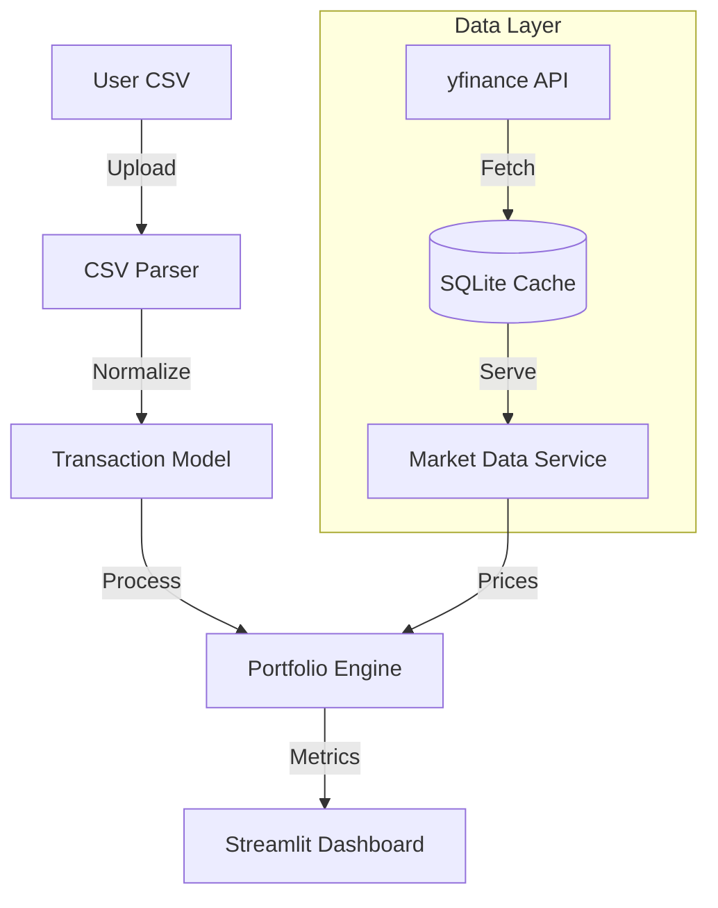

# Portfolio Viewer

A high-performance financial analytics dashboard built with Streamlit, designed for precision portfolio tracking, sophisticated performance metrics, and enterprise-grade data handling.

## 📋 Capabilities

### Core Features
- **Universal Import**: Smart parsing of CSV transaction logs with auto-detection for delimiters, locales (DE/EN), and column mappings.
- **Multi-Asset Support**: Native handling of Stocks, ETFs, Crypto, and Cash with automated asset type classification.
- **Foreign Exchange**: Automatic historical FX conversion (USD/EUR/DKK/etc.) for accurate base-currency valuation.

### Analytics & Visualization
- **XIRR Calculation**: Financial industry-standard Money-Weighted Return calculation using the Newton-Raphson method (via `scipy.optimize`).
- **Performance Attribution**: Interactive visualization of Net Deposits vs. Cost Basis vs. Market Value over configurable timeframes.
- **Holdings Analysis**: Drilling down into allocation, gains/losses, and tax-lot simulacra.

### Technical Architecture
- **Incremental Calculation Engine**: Implements an **O(N)** chronological state reconstruction algorithm for instantaneous historical charting, replacing legacy O(N²) methods.
- **Hybrid Caching**:
    - **Market Data**: Tiered SQLite caching strategy for high-frequency pricing data.
    - **Computation**: Memoized transaction processing for sub-second dashboard reloads.

## 🚀 Quick Start

### Prerequisites
- Python 3.9+
- pip

### Installation

1.  **Clone and Install Dependencies**
    ```bash
    pip install -r requirements.txt
    ```

2.  **Execution**
    ```bash
    streamlit run portfolio_viewer.py
    ```

## 📂 Data Ingestion

The ingestion engine supports flexible CSV schemas. The parser uses fuzzy matching to identify columns.

**Required Columns:**
- `Date` (ISO 8601 or local format)
- `Type` (Buy, Sell, Dividend, TransferIn/Out, etc.)

**Recommended Columns:**
- `Ticker` / `ISIN`
- `Shares` / `Quantity`
- `Price` / `Amount`
- `Total` (Net flux)
- `Currency` (if non-EUR)

## 🏗️ System Architecture



### Logging & Observability

The application maintains structured, rotating logs in `logs/portfolio_viewer.log` for debugging and audit trails.

- **Rotation**: 10MB limit, 5 backups.
- **Format**: `[TIMESTAMP] [LEVEL] [MODULE] Message`
- **Performance Tracing**: Operations exceeding 1000ms are flagged with `SLOW` log entries for bottleneck identification.

## 🛠️ Development

### Testing
```bash
# Verify integrity of tax logic and calculations
python -m unittest discover tests
```
