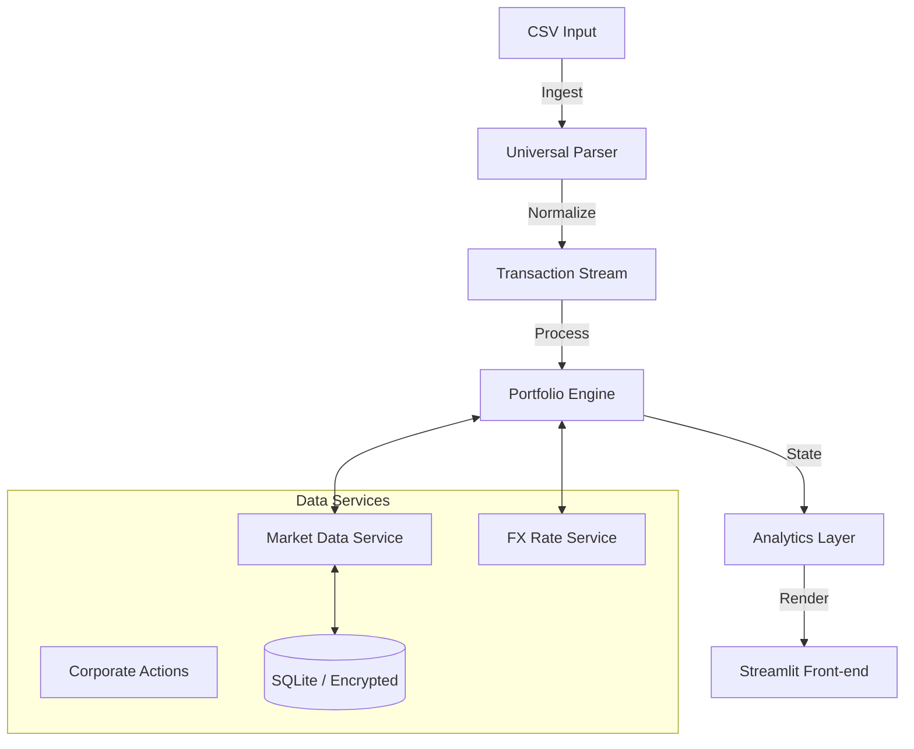

# Portfolio Viewer

A high-performance implementation of a portfolio tracking system designed for privacy, precision, and speed. Built with Python and Streamlit, it reconstructs portfolio history chronologically to provide institutional-grade metrics (XIRR, Volatility, Sharpe Ratio, Maximum Drawdown) without relying on external cloud aggregators.

## Overview

This application serves as a personal "blind trust" engine, allowing users to visualize and analyze their multi-asset portfolios (Stocks, ETFs, Crypto) securely on their local machine.

**Key Technical Differentiators:**
*   **Privacy-First Architecture:** No forced data upload. All processing happens locally on the user's machine.
*   **O(N) State Reconstruction:** Efficient linear-time algorithm to rebuild portfolio state from transaction logs vs standard O(N²) approaches.
*   **Institutional Metrics:** Implements Newton-Raphson method for precise XIRR (Money-Weighted Return) calculation.
*   **Hybrid Caching Layer:** Multi-tiered caching (Memory + SQLite) for market data and FX rates to minimize API latency and handle rate limits.

## Technical Architecture

The system follows a modular micro-services architecture pattern within a monolithic application:



### Core Components

*   **Portfolio Engine (`calculators/portfolio.py`)**: The kernel of the application. Processes the event stream of transactions (Buys, Sells, Dividends, Splits) to deterministic reconstruction of holdings and cash balances at any point in time.
*   **Market Data Service (`services/market_data.py`)**: A robust data fetcher that abstract multiple providers (yfinance, etc.). Handles fallback logic, rate limiting, and persistent caching.
*   **Universal Parser (`parsers/`)**: Heuristic-based CSV parser that auto-detects broker formats and normalizes them into a standard transaction model.

## Features

*   **Precision Tracking**: Handles stock splits, reverse splits, and spin-offs automatically via a dedicated Corporate Action Engine.
*   **Multi-Currency**: Native handling of assets in USD, EUR, GBP, CHF, etc., with historical spot-rate conversion to base currency.
*   **Performance Attribution**:
    *   **XIRR**: True money-weighted return.
    *   **Absolute Return**: Total gain/loss considering all cash flows.
    *   **Dividend Yield**: Tracking of income streams separate from capital appreciation.
*   **Secure Access**: Local authentication module with PBKDF2 hashing and anti-brute force delays.

## Installation & Usage

### Prerequisites
*   Python 3.9+
*   pip

### Setup

1.  **Clone the repository**
    ```bash
    git clone https://github.com/your-repo/portfolio-viewer.git
    cd portfolio-viewer
    ```

2.  **Install Dependencies**
    ```bash
    pip install -r requirements.txt
    ```

3.  **Run Application**
    ```bash
    streamlit run portfolio_viewer.py
    ```

### Configuration

Create a `.streamlit/secrets.toml` file for API keys and local security credentials.

```toml
[passwords]
app_password_hash = "pbkdf2_sha256$..." # Generated via utils/auth.py

[api]
# Optional: Fallback API keys for enhanced reliability
alpha_vantage_key = ""
finnhub_key = ""
```

## Data Privacy & Security

*   **Local Execution**: Transaction data is never sent to any server.
*   **Encryption**: Optional encryption keys can be configured to encrypt the local SQLite cache.
*   **Operational Security**: The application is designed to run in an air-gapped or local-only environment if necessary (excluding price fetching).

## Development

To run the test suite:

```bash
python -m unittest discover tests
```

## Module Map

The architecture is divided into the following key modules:

### Core Services (`services/`)
*   **`pipeline.py`**: Orchestrates the data ingestion (Parsing → ISIN Resolution → Corp Actions → FX → Validation).
*   **`market_data.py`** & **`market_cache.py`**: Handles checking redundant prices and caching them locally.
*   **`corporate_actions.py`**: Auto-detects and applies stock splits/reverse splits.
*   **`fx_rates.py`**: Fetches and caches historical forex rates for multi-currency portfolios.
*   **`isin_resolver.py`**: Maps ISINs to actionable tickers.
*   **`data_validator.py`**: Ensures transaction integrity before processing.

### Calculation Engine (`calculators/`)
*   **`portfolio.py`**: Reconstructs portfolio creation history and calculates current value.
*   **`metrics.py`**: Mathematical implementation of XIRR, Sharpe Ratio, Volatility, etc.

### User Interface (`ui/`)
*   **`styles.py`**: Central repository for CSS classes, design tokens, and aesthetic themes.
*   **`components.py`**: Reusable UI components (KPI dashboards, charts).
*   **`sidebar.py`**: Encapsulates sidebar logic, status display, and data controls.
*   **`utils.py`**: UI helpers (e.g., Privacy Mode masking).

### Utilities (`utils/`)
*   **`auth.py`**: Application security (Password hashing, Session checks).
*   **`logging_config.py`**: Standardized logging configuration.

### Charts (`charts/`)
*   **`visualizations.py`**: Plotly implementation for performance graphs and treemaps.

---
*Built for the discerning investor who demands ownership of their data.*
