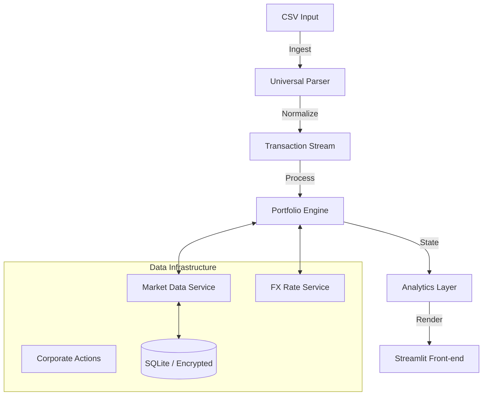

# Portfolio Viewer

**A self-hosted Portfolio Dashboard built with Python.**

---

### **Overview**
Portfolio Viewer is a local portfolio tracking application designed for users who want full control over their data and calculations. Unlike commercial aggregators or web-based services, this application runs entirely on your local machine or private server, reconstructing portfolio state directly from transaction logs.

**Main Features:**
*   **Extensible Logic**: Users can modify the `calculators/` directory to implement custom risk models or specific tax logic using standard Python, without needing to learn complex frontend frameworks.
*   **Self-Hosted & Private**: Designed to run on personal hardware (NAS, VPS, or Desktop). Data remains locally stored.
*   **Deployment Options**: Can be run locally for privacy, or deployed as a private web app (Docker supported) to share with others.

---

### **For Engineering Leaders & Recruiters**

This project demonstrates a production-grade implementation of a financial data pipeline, featuring:

#### **Technical Stack**
*   **Core**: Python 3.9+
*   **Frontend**: Streamlit (Reactive UI), Plotly (Interactive Visualizations)
*   **Data Processing**: Pandas (Vectorized operations), NumPy/SciPy (Financial Math models)
*   **Persistence**: SQLite (Local caching of market data), Parquet (High-performance storage)
*   **APIs**: yfinance, AlphaVantage, Finnhub (with automated failover strategies)

#### **Key Architectural Decisions**
1.  **O(N) State Reconstruction**: Implements a linear-time algorithm to rebuild portfolio history from an event stream (Buys, Sells, Splits, Dividends). This avoids the standard $O(N^2)$ complexity of re-calculating positions for every historical date.
2.  **Hybrid Caching Strategy**: Utilizes a multi-layered cache (in-memory L1 + SQLite L2) to handle market data. This significantly reduces API latency and mitigates rate-limiting issues from external providers.
3.  **Robust Fallback Mechanisms**: The **`MarketDataService`** employs a chain-of-responsibility pattern to fetch prices. If the primary provider (yfinance) fails, it automatically degrades to AlphaVantage or Finnhub without user interruption.
4.  **Corporate Action Engine**: A dedicated engine standardizes and handles complex corporate events (Stock Splits, Reverse Splits, Spinoffs) to ensure historical prices and share counts remain mathematically consistent over decades of data.

---

### **For Users**

#### **What does it do?**
Portfolio Viewer transforms your scattered broker export files into a unified, beautiful dashboard. It allows you to track your Net Worth, analyze asset allocation, and monitor performance against benchmarks without sharing your sensitive financial data with third-party cloud services.

#### **Key Features**
*   **🔒 Privacy First**: Your financial data never leaves your computer. No cloud uploads, no tracking.
*   **⚡ Professional Analytics**:
    *   **True Performance**: Uses **XIRR** (Extended Internal Rate of Return) for money-weighted return calculations, the gold standard for active portfolios.
    *   **Risk Metrics**: Automatically calculates Volatility, Sharpe Ratio, and Maximum Drawdown.
*   **Modern UI**: Features a responsive design with dark mode and mobile support.
*   **🤝 Secure Collaboration**: The application is container-ready. You can easily deploy a private instance to the cloud, giving friends, family, or clients their own "personal app" to view their portfolio, protected by **PBKDF2 SHA-256** authentication.
*   **🌍 Multi-Currency**: Native support for assets in USD, EUR, GBP, CHF, and more, with automatic historical currency conversion.

---

### **Deployment (Docker)**

Turn this script into a persistent application on your NAS or VPS in seconds.

1.  **Build the Image**
    ```bash
    docker build -t my-portfolio .
    ```

2.  **Run the Container**
    ```bash
    docker run -d -p 8501:8501 --name portfolio_app my-portfolio
    ```
    Access your dashboard at `http://localhost:8501`.

### **Installation (Local)**

#### **Prerequisites**
*   Python 3.9+
*   Git

#### **Setup**
1.  **Clone & Install**
    ```bash
    git clone https://github.com/your-repo/portfolio-viewer.git
    cd portfolio-viewer
    pip install -r requirements.txt
    ```

2.  **Run**
    ```bash
    streamlit run portfolio_viewer.py
    ```

#### **Configuration (Optional)**
To enable robust price fetching fallback, create a `.streamlit/secrets.toml` file:

```toml
[passwords]
app_password_hash = "pbkdf2_sha256$..." # Generated via utils/auth.py

[api]
alpha_vantage_key = "YOUR_KEY_HERE"
finnhub_key = "YOUR_KEY_HERE"
```

---

### **System Architecture**

The application follows a modular, micro-services inspired structure within a monolithic codebase to ensure maintainability and testability.



### **Module Map**

*   **`calculators/`**: The math core. Contains `portfolio.py` (State reconstruction) and `metrics.py` (XIRR/Sharpe implementation).
*   **`services/`**: Integration layer. Handles external APIs (`market_data.py`), caching (`market_cache.py`), and data logic (`corporate_actions.py`).
*   **`parsers/`**: Ingestion layer. Factory pattern parsers to normalize disparate broker CSV formats into a unified data model.
*   **`ui/`**: Presentation layer. Contains the Design System (`styles.py`) and specific view components.
*   **`charts/`**: Visualization layer. specialized Plotly wrappers for consistent, high-performance charting.

---

*Use this software at your own risk. Past performance is no guarantee of future results.*
